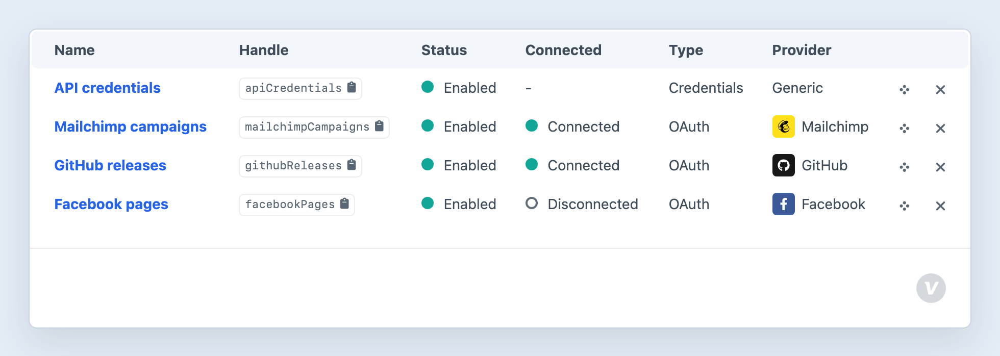

<!-- feature-intro -->
Create HTTP requests in Twig and reusable OAuth or credential clients for third-party APIs. Consume keeps connection details together and turns common response formats into data your templates can use.
<!-- feature-intro-end -->

<!-- feature-section media-size="large" -->
## Create clients once, use everywhere

Configure an OAuth or credential-based client once in the control panel, then use it wherever your templates need to make an authenticated request. Credentials and connection details stay out of the presentation layer.

<!-- feature-section-end -->

<!-- feature-section -->
## On-demand requests

Make Guzzle-backed requests from Twig when a page needs fresh remote data, with caching to avoid asking the upstream service the same question on every request. Parsing helpers turn JSON, XML and CSV into arrays, while HTML and raw text remain available when that is what the endpoint provides. Project-specific providers can sit behind the same reusable client interface.
<!-- feature-section-end -->
